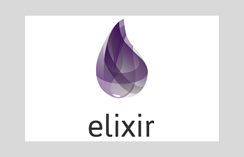

# Example Creating User Accounts (Backend in Elixir)

REST backend with registration, consultation, editing and deletion services of a customer data (name, email, password).

The main service receives registration information from a new customer, inserts it into the database (PostgreSQL) and sends a confirmation email to the address entered in the registration.

The service endpoints are as follows (assuming the elixir/phoenix server at http://localhost:4000):

> 1 - Insert New Customer (POST):
http://localhost:4000/api/users/create

Passing the parameters in the following pattern:
```json
{"user":
 {  
   "name": "Client name",
   "password": "pa55word",
   "mail": "client@mail.com"
  }
}
```
This service, in addition to registering, will also send a confirmation email to the customer.

> 2 - View list with all registered customers (GET):
http://localhost:4000/api/users

> 3 - Search Customer by ID (GET):
http://localhost:4000/api/users/find/<ID_CLIENT_HERE>
Example:
http://localhost:4000/api/users/find/3

> 4 - Delete a customer by ID (DELETE):
http://localhost:4000/api/users/delete/3<ID_CLIENT_HERE>
Example:
http://localhost:4000/api/users/delete/36

## Installing / Getting started

To start API/REST in your Phoenix server:

- Instal Phoenix/Exilir, [see instructions](https://hexdocs.pm/phoenix/installation.html)

- Download and install the postgresql database [here](http://www.postgresqltutorial.com/install-postgresql/)

- Configure the file config\dev.exs with your database connection data (username, password, database, etc.)

- To start your Phoenix server:

  * Install dependencies with `mix deps.get`
  * Create and migrate your database with `mix ecto.setup`
  * Install Node.js dependencies with `cd assets && npm install`
  * Start Phoenix endpoint with `mix phx.server`
  Now you can visit [`localhost:4000`](http://localhost:4000) from your browser.

> Learn more

  * Official website: http://www.phoenixframework.org/
  * Guides: https://hexdocs.pm/phoenix/overview.html
  * Docs: https://hexdocs.pm/phoenix
  * Mailing list: http://groups.google.com/group/phoenix-talk
  * Source: https://github.com/phoenixframework/phoenix

## Developing

### Built With

The following dependencies were used:

      elixir: "~> 1.5"
      {:phoenix, "~> 1.4.9"},
      {:phoenix_pubsub, "~> 1.1"},
      {:phoenix_ecto, "~> 4.0"},
      {:ecto_sql, "~> 3.1"},
      {:postgrex, ">= 0.0.0"},
      {:phoenix_html, "~> 2.11"},
      {:phoenix_live_reload, "~> 1.2", only: :dev},
      {:gettext, "~> 0.11"},
      {:jason, "~> 1.0"},
      {:plug_cowboy, "~> 2.0"},
      {:cors_plug, "~> 1.5"},
      {:bamboo, "~> 1.3"},
      {:bamboo_smtp, "~> 2.0.0"}

All of which are automatically installed with the command:
```shell
mix deps.get
```

### Prerequisites
What is needed to set up the dev environment.

- Instal Phoenix/Exilir, [see instructions](https://hexdocs.pm/phoenix/installation.html)

- Download and install the postgresql database [here](http://www.postgresqltutorial.com/install-postgresql/)

- Configure the file config\dev.exs with your database connection data (username, password, database, etc.)

### Setting up Dev

Here's a brief intro about what a developer must do in order to start developing
the project further:

```shell
git clone https://github.com/orlandopamplona/backend_elixir.git
cd backend-elixir
mix deps.get
Configure the file config\dev.exs with your database connection data (username, password, database, etc.)
Configure the file config\config.exs with your email connection data (port, smtp, user, password, etc.)
mix ecto.create
mix ecto.migrate
mix phx.server
```

### Deploying / Publishing

```shell
mix phx.server
```

## Database

The project uses the [PostgreSQL](https://www.postgresql.org) database (dependency {:postgrex, ">= 0.0.0"}).

[Ecto](https://elixirschool.com/en/lessons/ecto/basics/) is an official Elixir project providing a database wrapper and integrated query language (dependency {:ecto_sql, "~> 3.1"}).
